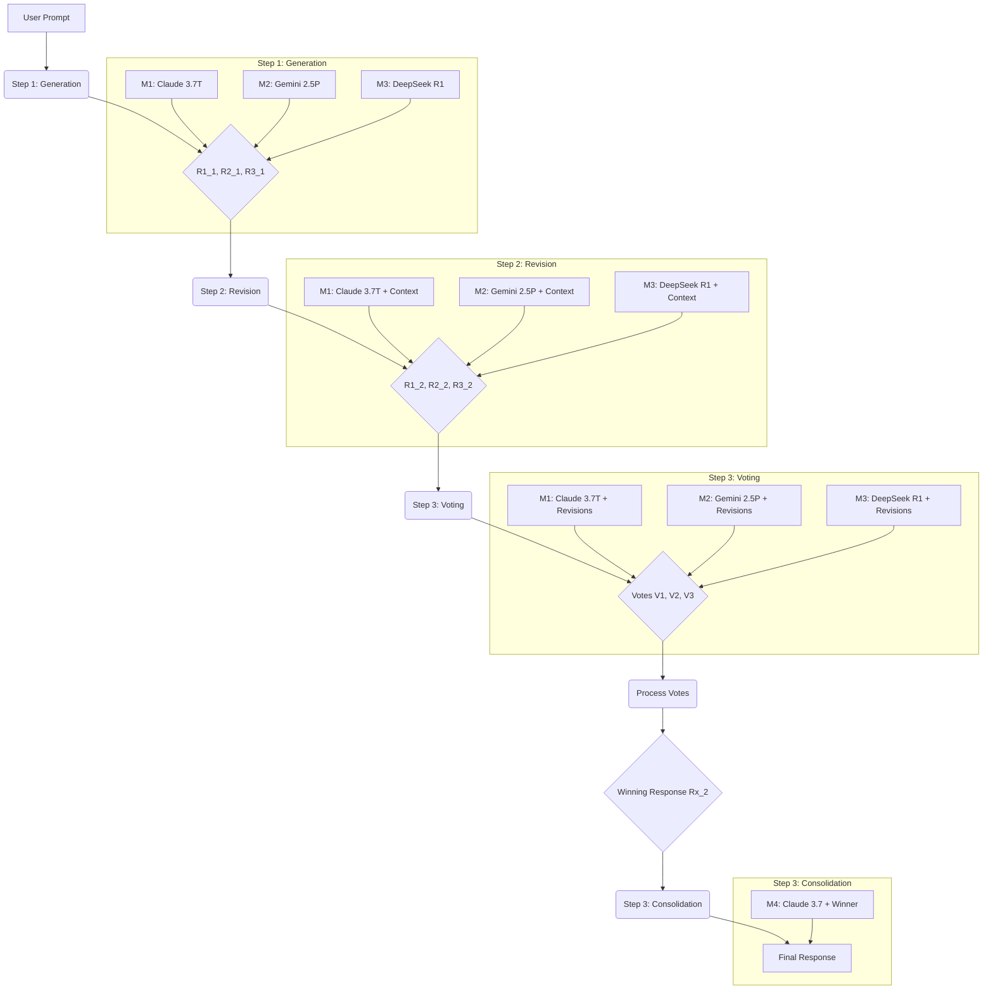

# System Patterns: CONXENSEVE

## 1. Core Architectural Pattern: Multi-Agent Sequential Collaboration

The CONXENSEVE system employs a sequential workflow where the output of one stage feeds into the next, involving multiple distinct AI agents (LLMs) with potentially specialized roles or instructions.

## 2. Key Process Steps & Logic

1.  **Generation:**
    *   Input: User prompt.
    *   Process: Send prompt independently to `M1`, `M2`, `M3`.
    *   Output: 3 initial code responses (`R1_1`, `R2_1`, `R3_1`).
2.  **Revision:**
    *   Input: User prompt, `R1_1`, `R2_1`, `R3_1`.
    *   Process: For each model `Mi`, construct a prompt containing the original task, all initial responses, and specific instructions emphasizing its strength (Claude: syntax, Gemini: context, DeepSeek: alternatives). Ask `Mi` to produce an *improved version* of its *own* initial idea.
    *   Output: 3 revised code responses (`R1_2`, `R2_2`, `R3_2`).
3.  **Voting:**
    *   Input: User prompt, `R1_2`, `R2_2`, `R3_2`.
    *   Process: For each model `Mi`, construct a prompt containing the original task, all revised responses, and specific instructions to vote based on its expertise. Ask for the *number* of the best solution and a brief justification.
    *   Output: 3 votes (`V1`, `V2`, `V3`).
4.  **Vote Processing:**
    *   Input: `V1`, `V2`, `V3`.
    *   Process (MVP): Parse the leading number from each vote. Tally votes. Determine winner(s). Handle ties by selecting the first winner in the list (1 > 2 > 3). Handle voting errors by defaulting to response #1 (Claude's revised).
    *   Output: Index of winning response (`winning_choice`), the winning response text (`winning_response`).
5.  **Consolidation:**
    *   Input: User prompt, `winning_choice`, `winning_response`.
    *   Process: Send a prompt to `M4` (Claude 3.7 Standard) containing the original task and the winning response. Instruct it to polish and finalize the code, outputting *only* the final code.
    *   Output: Final, consolidated code response.

## 3. Prompt Engineering Strategy

*   **Role Definition:** System prompts clearly define the expected role and expertise of the LLM at each stage (generator, reviewer, judge, polisher).
*   **Contextual Information:** Prompts explicitly include the original task and relevant outputs from previous stages.
*   **Specialized Instructions:** Revision and voting prompts contain specific instructions tailored to the perceived strengths of each model involved (Claude, Gemini, DeepSeek).
*   **Output Formatting:** Models are explicitly asked for specific output formats where necessary (e.g., "Output only the improved code", "Respond with ONLY the number..."). 